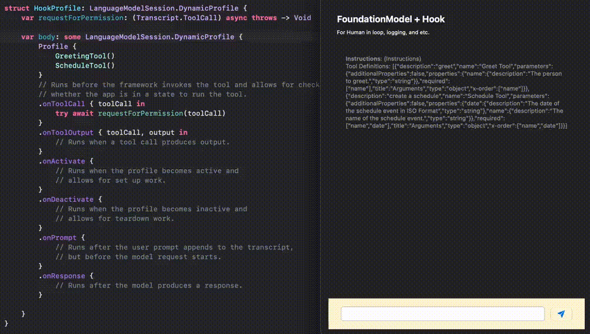

# Swift_FoundationModelsHook
A demo of using foundation model dynamic profile to implement hooks such as for human-in-loop.

For more details, please refer to my blog: [Swift: Hooks for Foundation Models. A Little Cleaner Way!
](https://medium.com/@itsuki.enjoy/swift-hooks-for-foundation-models-a-little-cleaner-way-c822ed2cb25b)

